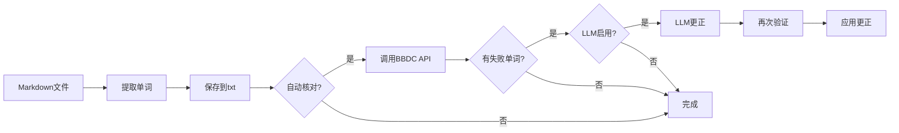

# BBDC Word Tool (Rust版本)

不背单词词书制作工具 - 使用 Rust 重构的高性能版本

## ✨ 特性

- 🚀 **高性能** - Rust 实现，速度更快，内存占用更少
- 📝 **Markdown 解析** - 从表格中自动提取单词
- 🔍 **自动核对** - 对接不背单词 API 自动验证
- 🤖 **AI 更正** - 使用 LLM 自动更正拼写错误（可选）
- 📦 **单文件部署** - 编译后只需一个可执行文件
- 🎨 **双界面** - 支持命令行（CLI）和图形界面（GUI）

## 📦 安装

### 从源码构建

```bash
# 克隆仓库
git clone <repo-url>
cd bbdc_rust

# 构建发布版本
cargo build --release

# 可执行文件位于 target/release/bbdc_word_tool
```

### 使用预编译版本

从 [Releases](链接) 下载对应平台的可执行文件。

## 🚀 快速开始

### 1. 配置环境变量（可选）

如果需要使用 LLM 自动更正功能，创建 `.env` 文件：

```bash
# 复制示例文件
cp .env.example .env

# 编辑 .env 文件，填入你的 API Key
SILICONFLOW_API_KEY=your_actual_key_here
```

获取 API Key: https://cloud.siliconflow.cn/

### 2. 提取单词

```bash
# 基础用法（提取单词 + 自动核对）
./bbdc_word_tool extract input.md

# 指定输出文件
./bbdc_word_tool extract input.md -o output.txt

# 不去重
./bbdc_word_tool extract input.md --unique=false

# 提取单词+词义
./bbdc_word_tool extract input.md -m with_meaning

# 提取单词+短语+词义
./bbdc_word_tool extract input.md -m full
```

### 3. 核对单词

```bash
# 核对已有的单词文件
./bbdc_word_tool check words.txt
```

### 4. 检查环境

```bash
# 检查 .env 配置和环境变量
./bbdc_word_tool env
```

### 5. 交互模式

```bash
# 直接运行，进入交互式界面
./bbdc_word_tool
```

## 📖 命令详解

### `extract` - 提取单词

从 Markdown 文件提取单词。

```bash
bbdc_word_tool extract [OPTIONS] <INPUT>
```

**选项:**
- `-o, --output <FILE>` - 输出文件路径
- `-u, --unique <BOOL>` - 是否去重（默认: true）
- `-c, --auto-check <BOOL>` - 是否自动核对（默认: true）
- `-m, --mode <MODE>` - 提取模式：
  - `words_only` - 仅提取单词（默认）
  - `with_meaning` - 单词+释义
  - `full` - 单词+短语+释义

**示例:**

```bash
# 提取单词并自动核对
./bbdc_word_tool extract vocabulary.md

# 提取单词但不核对
./bbdc_word_tool extract vocabulary.md --auto-check=false

# 提取单词+释义
./bbdc_word_tool extract vocabulary.md -m with_meaning -o result.txt
```

### `check` - 核对单词

使用不背单词 API 核对单词文件。

```bash
bbdc_word_tool check <INPUT>
```

**示例:**

```bash
./bbdc_word_tool check my_words.txt
```

### `env` - 环境检查

检查配置文件和环境变量状态。

```bash
bbdc_word_tool env
```

## 🔧 配置说明

### 环境变量

程序会按以下顺序查找 `.env` 文件：

1. 可执行文件所在目录
2. 当前工作目录
3. 父目录

**支持的环境变量:**

| 变量名 | 说明 | 是否必需 | 默认值 |
|--------|------|---------|--------|
| `SILICONFLOW_API_KEY` | SiliconFlow API密钥 | 否* | 无 |
| `SILICONFLOW_BASE_URL` | API基础地址 | 否 | https://api.siliconflow.cn/v1/chat/completions |
| `SILICONFLOW_MODEL` | 使用的模型 | 否 | Qwen/Qwen2.5-7B-Instruct |

\* 如果要使用 LLM 自动更正功能则必需

### 日志级别

通过环境变量 `RUST_LOG` 控制日志级别：

```bash
# 显示详细日志
RUST_LOG=debug ./bbdc_word_tool extract input.md

# 只显示错误
RUST_LOG=error ./bbdc_word_tool extract input.md
```

## 📊 工作流程

完整的处理流程：



## 🆚 与 Python 版本对比

| 特性 | Python 版本 | Rust 版本 |
|------|------------|----------|
| 启动速度 | ~1-2秒 | <0.1秒 |
| 内存占用 | ~50MB | ~5MB |
| 性能 | 中等 | 快（2-5x） |
| 部署 | 需要Python环境 | 单文件 |
| 二进制大小 | PyInstaller ~30MB | ~8MB |
| 跨平台 | ✅ | ✅ |
| GUI | ✅ (tkinter) | ⏳ (开发中) |

## 🛠️ 开发指南

### 项目结构

```
bbdc_rust/
├── src/
│   ├── main.rs           # 程序入口
│   ├── lib.rs            # 库定义
│   ├── env_loader.rs     # 环境变量加载
│   ├── word_extractor.rs # 单词提取
│   ├── bbdc_checker.rs   # BBDC API 核对
│   ├── llm_corrector.rs  # LLM 自动更正
│   └── cli.rs            # CLI 命令行界面
├── Cargo.toml            # 项目配置
├── .env.example          # 环境变量示例
└── README.md             # 本文档
```

### 构建选项

```bash
# 开发构建（快速编译，包含调试信息）
cargo build

# 发布构建（优化性能）
cargo build --release

# 运行测试
cargo test

# 运行并查看详细日志
RUST_LOG=debug cargo run -- extract test.md

# 代码检查
cargo clippy

# 格式化代码
cargo fmt
```

### 添加新功能

1. 在对应模块中实现功能
2. 在 `lib.rs` 中导出
3. 在 `cli.rs` 中添加命令
4. 编写测试
5. 更新文档

## 📝 常见问题

### Q: 为什么要用 Rust 重构？

A: Rust 版本具有以下优势：
- 更快的启动速度和运行性能
- 更小的内存占用
- 单文件部署，无需 Python 环境
- 类型安全，编译时捕获更多错误

### Q: 如何获取 SiliconFlow API Key？

A: 访问 https://cloud.siliconflow.cn/ 注册账号，在控制台获取 API Key。

### Q: 程序找不到 .env 文件？

A: 运行 `bbdc_word_tool env` 检查搜索路径，确保 `.env` 文件放在以下位置之一：
- 可执行文件所在目录
- 当前工作目录

### Q: LLM 自动更正不工作？

A: 检查：
1. 是否设置了 `SILICONFLOW_API_KEY`
2. API Key 是否有效
3. 网络连接是否正常
4. 运行 `bbdc_word_tool env` 查看配置状态

### Q: 编译出错？

A: 确保：
1. Rust 版本 >= 1.70
2. 网络连接正常（下载依赖）
3. 查看错误信息，可能缺少系统依赖

## 🤝 贡献

欢迎提交 Issue 和 Pull Request！

## 📄 许可证

MIT License

## 🔗 相关链接

- [不背单词官网](https://bbdc.cn/)
- [SiliconFlow 官网](https://siliconflow.cn/)
- [Rust 官网](https://www.rust-lang.org/)

---

**注意**: 本工具仅供学习使用，请遵守相关 API 的使用条款。

